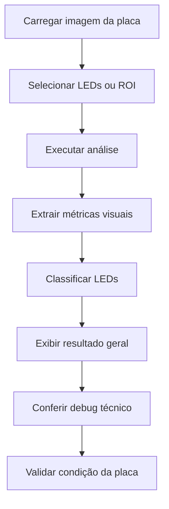

# ODIN

Sistema desktop em **Python** para análise visual de LEDs em placas PCI, desenvolvido para apoiar processos de inspeção, validação e diagnóstico técnico em ambiente produtivo.

O projeto permite carregar imagens de placas, selecionar LEDs, executar uma análise visual assistida e identificar o estado dos componentes entre **aceso** e **apagado**, exibindo métricas, visualizações técnicas e informações de depuração em uma interface operacional.

---

## Visão geral

O **ODIN** foi criado para reduzir a dependência de inspeção puramente visual em placas com múltiplos LEDs.

Em processos repetitivos, a validação manual pode se tornar cansativa, sujeita a falhas e difícil de padronizar. A proposta do sistema é oferecer uma camada de apoio técnico para o operador, combinando análise visual, seleção de regiões de interesse e exibição clara dos resultados.

A aplicação centraliza em uma única tela:

* imagem principal da placa analisada;
* identificação visual dos LEDs;
* contagem de LEDs acesos e apagados;
* resultado geral da análise;
* mapa de intensidade;
* canal V da imagem;
* máscara da região analisada;
* ROI ampliado para depuração;
* resumo técnico da análise.

---

## Interface do sistema

### Tela principal de análise


A interface foi pensada para uso técnico e operacional, permitindo que o operador acompanhe o resultado da análise sem precisar alternar entre várias telas.

---

## Objetivo do projeto

O objetivo do ODIN é apoiar a inspeção visual de placas PCI com LEDs, tornando o processo mais padronizado, rastreável e menos dependente apenas da observação humana.

O sistema foi desenvolvido com foco em:

* reduzir falhas de inspeção visual;
* facilitar a identificação de LEDs apagados;
* apoiar operadores em análises repetitivas;
* fornecer visualizações técnicas para conferência;
* permitir evolução futura para captura ao vivo com câmera;
* organizar a base do projeto de forma modular para manutenção e expansão.

---

## Principais recursos

* Carregamento de imagem para análise.
* Seleção manual de LEDs ou regiões de interesse.
* Análise visual assistida do estado dos LEDs.
* Classificação entre LED aceso e LED apagado.
* Contagem total de LEDs analisados.
* Exibição de confiança média da análise.
* Visualização do canal V.
* Geração de mapa de intensidade.
* Exibição de máscara / ROI selecionado.
* ROI ampliado para depuração técnica.
* Painel de debug com métricas por LED.
* Barra inferior de status com resumo do resultado.
* Interface preparada para evolução com câmera ao vivo.

---

## Métricas e informações exibidas

Durante a análise, o sistema apresenta informações técnicas úteis para validação e depuração, como:

| Métrica                | Descrição                                                                  |
| ---------------------- | -------------------------------------------------------------------------- |
| Valor binário          | Quantidade de LEDs classificados como acesos em relação ao total analisado |
| Confiança média        | Indicador geral de segurança da análise                                    |
| `v_mean`               | Média de intensidade no canal V                                            |
| `v_max`                | Valor máximo de intensidade detectado                                      |
| Distância para aceso   | Distância calculada em relação ao padrão de LED aceso                      |
| Distância para apagado | Distância calculada em relação ao padrão de LED apagado                    |
| Glow score             | Indicador auxiliar relacionado ao brilho detectado                         |
| Status geral           | Resultado consolidado da análise da placa                                  |

---

## Fluxo de funcionamento



---

## Exemplo de uso

Um fluxo básico de operação do sistema segue esta lógica:

1. O operador abre o ODIN.
2. Carrega a imagem da placa.
3. Seleciona os LEDs que devem ser analisados.
4. Executa a análise.
5. O sistema identifica LEDs acesos e apagados.
6. A interface exibe o resultado geral da placa.
7. O operador pode conferir o mapa de intensidade, a máscara, o ROI ampliado e o debug técnico.
8. A condição da placa é validada com base no resultado apresentado.

---

## Estrutura do projeto

```bash
ODIN/
├── assets/
├── data/
│   └── config/
├── src/
├── config.py
├── main.py
├── requirements.txt
└── estrutura_projeto.md
```

---

## Organização da interface

A interface foi modularizada para facilitar manutenção e evolução do projeto, preservando a classe pública principal `ODINView`.

A organização da interface separa responsabilidades como:

| Módulo      | Responsabilidade                                       |
| ----------- | ------------------------------------------------------ |
| `layout`    | Montagem estrutural da interface                       |
| `panels`    | Painéis principais da tela                             |
| `widgets`   | Componentes reutilizáveis                              |
| `canvas`    | Desenho da imagem, LEDs, resultados e marcações        |
| `image`     | Redimensionamento, exibição e conversão de coordenadas |
| `state`     | Controle e normalização do estado visual               |
| `updates`   | Atualização de textos, KPIs e renderizações            |
| `history`   | Histórico, observações, confiança e data/hora          |
| `settings`  | Configurações do sistema                               |
| `lifecycle` | Inicialização e ciclo de vida da janela                |

Essa separação torna o código mais organizado e facilita futuras melhorias sem alterar diretamente as regras principais de análise.

---

## Tecnologias utilizadas

* **Python**
* Interface desktop modular
* Processamento visual de imagem
* Estrutura organizada em módulos
* Sistema de análise baseado em métricas visuais

---

## Como executar o projeto

### 1. Clone o repositório

```bash
git clone https://github.com/carlosdaniel003/ODIN.git
```

### 2. Acesse a pasta do projeto

```bash
cd ODIN
```

### 3. Instale as dependências

```bash
pip install -r requirements.txt
```

### 4. Execute a aplicação

```bash
python main.py
```

---

## Aplicações possíveis

O ODIN pode ser utilizado como apoio em cenários como:

* inspeção visual de placas PCI com LEDs;
* validação de placas em bancada;
* apoio à produção;
* apoio à engenharia de testes;
* conferência técnica de falhas visuais;
* análise assistida em processos de qualidade;
* prototipagem de soluções de visão computacional industrial.

---

## Status do projeto

O projeto está em evolução, com base funcional para análise visual assistida e interface técnica de validação.

Funcionalidades já contempladas:

* carregamento de imagem;
* seleção de LEDs;
* análise visual;
* classificação de LEDs acesos e apagados;
* exibição de métricas técnicas;
* visualização de debug;
* estrutura modular da interface.

---

## Melhorias futuras

Algumas evoluções planejadas ou possíveis para o projeto:

* integração mais avançada com câmera ao vivo;
* histórico de análises;
* exportação de relatórios;
* calibração refinada de parâmetros;
* perfis de configuração por modelo de placa;
* melhorias na rastreabilidade;
* automação parcial do processo de inspeção;
* integração com banco de dados ou sistema interno de qualidade.

---

## Autor

**Carlos Daniel**
Desenvolvedor Full Stack | Técnico em Eletrônica

GitHub: [carlosdaniel003](https://github.com/carlosdaniel003)

---

## Observação

Este projeto foi desenvolvido com foco em aplicação prática para inspeção técnica, combinando conhecimentos de eletrônica, programação, interface operacional e análise visual.
