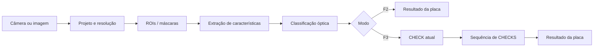
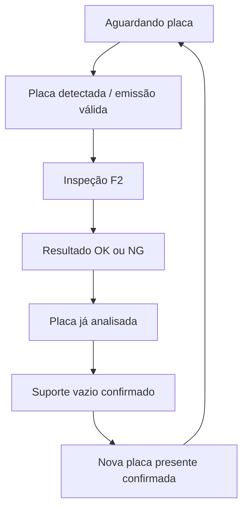
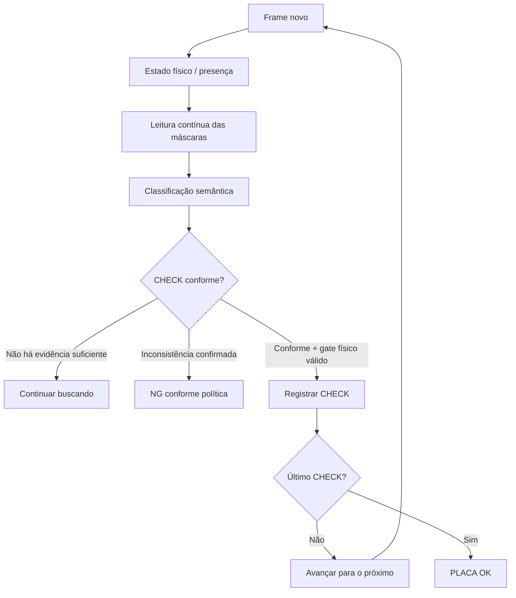
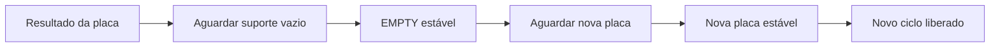

# ODIN

Sistema desktop de **visão computacional para inspeção industrial de placas eletrônicas**, desenvolvido em **Python, OpenCV e Tkinter**.

A branch `display` reúne três áreas do mesmo produto:

- uma área de **engenharia e parametrização**, usada para câmera, imagens, ROIs, referências e diagnóstico;
- a **Produção F2**, voltada à inspeção de LEDs e segmentos de uma placa;
- a **Produção Display F3**, voltada à inspeção automática de uma sequência configurável de estados do display.

F2 e F3 compartilham componentes de baixo nível — câmera, extração de características, geometria de ROI e utilitários de visão —, mas possuem **projetos, estado operacional, ciclo produtivo e regras de decisão separados**.

> Este README documenta o comportamento atual da branch `display`.

---

## Visão geral

O ODIN foi construído para reduzir a dependência da inspeção puramente visual em placas com LEDs e displays. O sistema transforma referências reais capturadas da própria montagem em parâmetros de comparação e mantém a decisão rastreável por meio de métricas, overlays e ferramentas de debug.

O fluxo geral é:


```mermaid
flowchart LR
    A[Câmera ou imagem] --> B[Projeto e resolução]
    B --> C[ROIs / máscaras]
    C --> D[Extração de características]
    D --> E[Classificação óptica]
    E --> F{Modo}
    F -->|F2| G[Resultado da placa]
    F -->|F3| H[CHECK atual]
    H --> I[Sequência de CHECKS]
    I --> J[Resultado da placa]
```

A aplicação possui captura ao vivo, seleção visual de câmera, projetos por produto, resolução mestre, referências ópticas, ROIs circulares e segmentadas, visualização técnica, logging, persistência de configuração e execução dedicada em Linux/Raspberry Pi.

---

# 1. Inicialização e arquitetura

O ponto de entrada é `main.py`, que chama `main_rpi.py`. Em Linux, antes de iniciar a interface, o bootstrap prepara uma área de configuração local persistente; em seguida é criada a classe final `RaspberryPi3ProductionApp`.

```text
main.py
  └─ main_rpi.py
      └─ RaspberryPi3ProductionApp
          ├─ área de engenharia / parametrização
          ├─ Produção F2
          ├─ Produção Display F3
          ├─ serviços de câmera
          ├─ persistência
          └─ GPIO / teclado / runtime
```

A organização principal do código é:

| Camada | Responsabilidade |
| --- | --- |
| `src/core` | classificação, extração de features, geometria de ROI, regras ópticas e renderização |
| `src/models` | estruturas de dados de seleção, features, métricas e resultados |
| `src/infra` | câmera, configuração, arquivos, resultados e logs |
| `src/ui` | interface principal e janelas operacionais |
| `src/platform` | composição do produto, F2, F3, Raspberry/Linux/Windows, câmera e extensões de runtime |
| `tests` | testes unitários e de regressão dos fluxos de visão, câmera, F2 e F3 |
| `.github/workflows` | validações automatizadas específicas por subsistema |

A classe `RaspberryPi3ProductionApp` é composta por mixins. No F3, diversas camadas são instaladas em ordem deliberada para separar presença física, análise de máscara, estabilidade, performance e apresentação. O comportamento descrito neste README considera o **encadeamento final**, e não apenas as implementações-base isoladas.

---

# 2. Núcleo de visão computacional

## 2.1 Características extraídas

A análise não depende somente da média de brilho de uma ROI. O extrator trabalha principalmente no espaço HSV e calcula informações como:

| Grupo | Exemplos |
| --- | --- |
| Intensidade | `v_mean`, `v_max`, `v_min`, `v_std`, `v_p90`, `v_p95`, `v_p99` |
| Saturação | `s_mean`, `s_std`, `s_p90` |
| Cor | `h_mean` |
| Centro x entorno | `center_to_ring_v`, `center_to_ring_s` |
| Emissão forte | percentuais de pixels acima de 220, 235, 245 e 250 |
| Glow | `glow_score` |
| Geometria | áreas total, interna e de anel |

O `ReferenceLedClassifier` compara as características atuais com referências reais de **ACESO** e **APAGADO**, combinando distância entre referências, votos por métricas, brilho, pico, contraste e glow.

## 2.2 Geometrias de ROI

O ODIN suporta diferentes geometrias sem converter tudo para um círculo:

- círculo;
- segmento retangular rotacionado;
- segmento livre/poligonal.

A mesma geometria é preservada na edição, persistência, adaptação de resolução, análise e overlay.

## 2.3 Estado POUCA LUZ

O motor também possui suporte a `POUCA LUZ`. Quando habilitado por uma referência válida, esse estado indica que existe emissão, mas ela não apresenta a qualidade luminosa esperada.

Na apresentação visual atual:

- **verde** representa `ACESO`;
- **azul** representa `APAGADO` em resultados/NG do fluxo principal;
- **amarelo** representa `POUCA LUZ`.

A classe `POUCA LUZ` não é tratada como uma placa conforme.

---

# 3. Área de engenharia e parametrização

Antes da produção, a aplicação pode ser usada para preparar o projeto e verificar o comportamento óptico.

Entre as funções disponíveis estão:

- carregar imagem estática;
- iniciar câmera ao vivo;
- escolher visualmente a câmera antes da operação;
- selecionar ROIs manualmente;
- detectar automaticamente pontos luminosos;
- criar círculos, segmentos rotacionados e segmentos livres;
- salvar conjuntos de ROIs por projeto;
- capturar referências reais;
- configurar resolução mestre;
- alterar parâmetros de câmera ao vivo quando suportados pelo hardware;
- visualizar canal V, mapa de intensidade, máscara e ROI ampliada;
- consultar métricas e debug textual detalhado.


---

# 4. Produção F2

A Produção F2 é o fluxo operacional para validar LEDs/segmentos configurados em um **Projeto LED**.

Ela é aberta pelo botão `PRODUÇÃO F2` ou pela tecla **F2**.

## 4.1 Configuração do F2

Um Projeto LED reúne as máscaras fixas, referências e resolução associadas ao produto. Os projetos são mantidos pelo `ConfigRepository` e pela extensão de projetos LED.

As referências ópticas do F2 são organizadas por estado:

| Referência | Obrigatória | Uso |
| --- | ---: | --- |
| ACESO | Sim | padrão óptico de emissão correta |
| APAGADO | Sim | padrão óptico sem emissão |
| POUCA LUZ | Não | diagnóstico de emissão abaixo do padrão |

Cada estado aceita até **3 amostras ativas**, que podem pertencer ao projeto atual ou ter escopo global. Quando existem várias amostras, as features ativas são agregadas para formar o perfil usado pelo classificador.

## 4.2 Referências físicas de presença do F2

Além das referências ópticas de LED, o F2 possui três referências visuais próprias por projeto:

1. **Placa fixa ligada**;
2. **Placa fixa desligada**;
3. **Placa fora do suporte**.

Quando as três estão configuradas, elas formam a autoridade de presença do ciclo automático. A comparação considera intensidade e bordas da cena e exige separação suficiente entre as referências para evitar decisões por empate visual.

Se as referências físicas não estiverem disponíveis, existe um fallback visual para detectar remoção da placa usando a cena e a região do fixture sem transformar esse fallback na regra normal quando o conjunto 3/3 está pronto.

## 4.3 Análise da placa no F2

O `OperationEngine` prepara o frame uma vez, converte para HSV e analisa todas as ROIs ativas usando o classificador por referência.

O resultado geral é simples:

```text
TODAS AS ROIs = ACESO  ->  PLACA OK
qualquer APAGADO       ->  PLACA NG
qualquer POUCA LUZ     ->  PLACA NG
```

O F2 também aplica uma guarda física de emissão. Ela busca evidência de núcleo luminoso e emissão real antes de aceitar determinados casos como `ACESO`, reduzindo falsos positivos causados por reflexo ou brilho espalhado de LEDs próximos.

## 4.4 Análise automática do F2

O modo automático monitora continuamente as ROIs e pode iniciar a inspeção sem pressionar Enter quando existe evidência luminosa estável suficiente.

O disparo automático não substitui os controles manuais. **Enter, teclado numérico e GPIO** continuam disponíveis quando aplicáveis.

Após uma análise concluída, o automático é bloqueado para impedir a reinspeção da mesma placa. O novo ciclo exige a sequência física:


```mermaid
flowchart TD
    A[Aguardando placa] --> B[Placa detectada / emissão válida]
    B --> C[Inspeção F2]
    C --> D[Resultado OK ou NG]
    D --> E[Placa já analisada]
    E --> F[Suporte vazio confirmado]
    F --> G[Nova placa presente confirmada]
    G --> A
```

A nova placa pode entrar no suporte já ligada; não existe obrigação de passar primeiro pelo estado desligado para rearmar o automático.

## 4.5 Status e overlay do F2

Durante o automático, o painel informa o estado físico da placa e pode exibir as ROIs diretamente no vídeo.

O status de presença diferencia placa ligada, placa desligada, suporte vazio e placa já analisada. Após OK ou NG, enquanto o sistema aguarda a troca física, o status principal mostra de forma responsiva:

```text
PLACA JÁ ANALISADA
COLOQUE OUTRA PLACA
```

O texto reserva duas linhas reais e ajusta o tamanho da fonte conforme a largura do painel para evitar corte em telas menores.

## 4.6 F2 no Linux

No Linux, a geometria produtiva do F2 é protegida por uma regra específica: **640x480**.

Durante a Produção F2:

- o serviço é preparado para 640x480;
- frames com outra resolução são rejeitados;
- a sincronização dinâmica das máscaras é bloqueada;
- uma renegociação inesperada do driver não pode redimensionar ou deslocar as ROIs da placa em produção.

Essa trava é específica do F2/Linux. No Windows, essa regra fixa de 640x480 não é aplicada.

---

# 5. Produção Display F3

O F3 é um modo de produção independente destinado a validar uma **sequência de estados do display**.

Ele é aberto pelo botão `DISPLAY F3` ou pela tecla **F3**.

O F3 possui:

- repositório de projetos próprio;
- máscaras próprias;
- CHECKS próprios;
- contadores próprios;
- janela operacional própria;
- referências e aprendizado próprios;
- máquina de estados própria;
- ciclo de remoção/rearme próprio.

O F3 não usa o progresso do F2 para avançar sua sequência. Se o F2 estiver aberto, o F3 não inicia simultaneamente.

## 5.1 Projeto Display

Os projetos Display ficam em `data/config/odin_display_projects.json` e utilizam schema próprio.

Cada projeto contém:

- nome;
- resolução mestre;
- máscaras;
- ordem dos CHECKS;
- estado esperado de cada máscara em cada CHECK.

Os estados configuráveis de uma máscara dentro de um CHECK são:

| Estado | Significado |
| --- | --- |
| `on` | deve estar ACESA |
| `off` | deve estar APAGADA |
| `ignore` | não participa da decisão daquele CHECK |

Um projeto novo utiliza por padrão os nomes:

```text
H1 -> BLUE -> AUX -> USB
```

Essa lista é apenas o padrão inicial. A sequência é configurável e o runtime trabalha pelos IDs/ordem dos CHECKS, permitindo outros nomes e novos CHECKS.

## 5.2 Aprendizado semântico do F3

O F3 possui armazenamento de aprendizado próprio em `odin_display_learning.json`.

Os estados disponíveis são:

- **ACESO**;
- **APAGADO**;
- **POUCA LUZ**.

ACESO e APAGADO formam o par necessário para a classificação semântica normal. POUCA LUZ é opcional. Assim como no conjunto de referências do F2, cada estado suporta até **3 referências ativas**, com escopo por projeto ou global.

No runtime final da branch `display`, a decisão semântica oficial das máscaras volta ao `DisplayAutomaticCheckAnalyzer`, baseado no classificador aprendido de ACESO/APAGADO e, quando disponível, POUCA LUZ. As fotografias completas dos CHECKS continuam importantes, mas possuem funções físicas, de sonda positiva e de diagnóstico; elas não substituem sozinhas toda a semântica do classificador de máscara.

## 5.3 Referências físicas e visuais do F3

O F3 trabalha com dois níveis diferentes de fotografia de referência.

### Referências do projeto

São capturadas duas cenas físicas:

1. **PLACA DESLIGADA NO SUPORTE**;
2. **PLACA FORA DO SUPORTE**.

Elas ajudam a determinar presença/remoção e estado físico da placa.

### Referência de cada CHECK

Cada CHECK pode possuir uma fotografia visual própria da cena naquele estado. Essa imagem é usada por diferentes componentes do F3 para comparação física, sonda positiva, diagnóstico e apoio à identificação visual.

### ROI da referência visual

As referências visuais podem utilizar uma ROI normalizada. A mesma região é recortada na referência e no frame ao vivo, reduzindo a influência de áreas da cena que não ajudam a distinguir os estados.

As comparações finais de presença possuem caminhos que trabalham **ROI primeiro e em resolução cheia**, antes das reduções usadas para acelerar partes do matching.

## 5.4 Separação entre estado físico e julgamento das máscaras

Uma regra central do F3 atual é que **presença física e análise de máscara são informações diferentes**.

O estado físico pode impedir que o sistema registre OK/NG ou avance um CHECK, mas as máscaras do CHECK atual permanecem em leitura e podem continuar atualizando overlay e diagnóstico.

Isso evita um deadlock em que uma comparação global da cena chama a placa de `OFF` e, ao mesmo tempo, impede o próprio analisador de enxergar que os segmentos do display estão acesos.

Estados como **suporte vazio** e **referências indisponíveis** permanecem bloqueios absolutos. Um falso `OFF` pode ser reconciliado somente quando existe evidência positiva real nas máscaras do CHECK atual.

## 5.5 Análise automática do F3

O fluxo conceitual atual é:


```mermaid
flowchart TD
    A[Frame novo] --> B[Estado físico / presença]
    B --> C[Leitura contínua das máscaras]
    C --> D[Classificação semântica]
    D --> E{CHECK conforme?}
    E -->|Não há evidência suficiente| F[Continuar buscando]
    E -->|Inconsistência confirmada| G[NG conforme política]
    E -->|Conforme + gate físico válido| H[Registrar CHECK]
    H --> I{Último CHECK?}
    I -->|Não| J[Avançar para o próximo]
    J --> A
    I -->|Sim| K[PLACA OK]
```

A implementação possui cache de referências, gate por frame novo e cadência adaptativa para evitar que o Tkinter acumule callbacks quando uma análise demora mais que o intervalo nominal.

## 5.6 Primeiro CHECK e aprovação positiva

O primeiro CHECK da sequência funciona como **referência inicial do ciclo**. O runtime também reconhece `H1` semanticamente quando aplicável, mas a lógica não depende exclusivamente desse nome.

O primeiro CHECK **não gera NG automático**. Se ele ainda não estiver conforme, o sistema continua procurando a condição de referência.

O F3 possui uma sonda positiva que pode comparar o frame com o gabarito visual exato do CHECK esperado. Essa sonda é usada para capturar rapidamente um estado positivo e **não gera NG**.

No encadeamento final atual, a camada `display_f3_single_frame_approval` estabelece:

```text
CHECK aprovado = 1 frame positivo válido
```

Essa regra vale para qualquer CHECK atual ou futuro. Ela reduz apenas o número de frames positivos necessários; não remove os gates físicos, a exigência de conformidade das máscaras nem as validações de contexto.

O NG continua usando debounce conservador e não é transformado em uma reprovação instantânea por essa otimização.

## 5.7 Regras de NG do F3

O F3 foi construído para evitar reprovar uma placa apenas porque ainda não conseguiu identificar um estado.

Entre as proteções do runtime:

- leitura ambígua continua em busca em vez de inventar uma decisão;
- no primeiro CHECK, divergência não vira NG automático;
- uma máscara esperada ACESA aparecer APAGADA não basta para declarar defeito se toda a placa também parece desligada;
- para confirmar esse tipo de NG, deve existir evidência independente de que a placa está realmente energizada;
- um segmento ACESO onde deveria estar APAGADO é uma inconsistência semântica;
- POUCA LUZ, quando a classe está disponível e é identificada onde não deveria ocorrer, é tratada como condição de falha;
- o estado visual de cena inteira não é, sozinho, autoridade para declarar um NG de máscara.

A política separa `SEARCHING`, `OK` e `NG`, com gate de confiança e estabilidade próprios.

## 5.8 CHECK transitório e estados rápidos

O runtime identifica CHECKS transitórios, como BLUE/Bluetooth/BT, e possui caminhos de captura rápida para não perder um estado que aparece por pouco tempo.

Mesmo nesses casos, o fast path não transforma `PLACA DESLIGADA`, `PLACA FORA DO SUPORTE` ou referência indisponível em autorização automática. A aceleração só ocorre quando existe evidência positiva compatível com uma placa ligada.

## 5.9 Latch do ciclo energizado

Depois que o primeiro CHECK é confirmado, o F3 pode memorizar que a placa pertence a um ciclo energizado.

Isso resolve um problema comum de visão global: durante a troca entre estados, quase toda a imagem continua parecida com a fotografia da placa desligada e o matcher de cena pode oscilar temporariamente para `OFF`.

Nesse período, o status pode assumir semanticamente:

```text
PLACA NO SUPORTE • LIGADA • AGUARDANDO <CHECK>
```

Essa memória **não aprova o próximo CHECK**. Ela mantém o ciclo físico coerente até que o CHECK atual produza sua própria evidência.

O latch é limpo quando ocorre resultado terminal, suporte vazio, descarte, fechamento ou início de uma nova sessão F3.

## 5.10 Status ANÁLISE VISUAL

O F3 possui um status paralelo explicitamente identificado como **ANÁLISE VISUAL**.

Ele compara a cena ao vivo com:

- PLACA FORA DO SUPORTE;
- PLACA DESLIGADA NO SUPORTE;
- fotografias configuradas dos CHECKS.

A comparação utiliza as ROIs visuais quando existentes, trabalha com ranking de similaridade e possui fallback relativo quando nenhuma referência atinge o threshold absoluto, mas uma delas vence as demais com separação suficiente.

Para evitar que uma fotografia de CHECK vença apenas porque placa, suporte e fundo são muito parecidos, existe ainda um desempate visual que compara, **na mesma ROI do CHECK**, a fotografia do CHECK contra a fotografia da placa desligada.

Exemplos de mensagens:

```text
ANÁLISE VISUAL: PLACA FORA DO SUPORTE • 94%
ANÁLISE VISUAL: PLACA DESLIGADA NO SUPORTE • 96%
ANÁLISE VISUAL: CHECK BLUE • 91%
ANÁLISE VISUAL: referências muito próximas • identificando...
```

Esse status é **estritamente informativo**:

```text
não usa o estado esperado das máscaras
não registra OK ou NG
não avança CHECK
não rearma ciclo
não altera resultado
não interfere no F2
```

## 5.11 Resultado e rearme do F3

Depois de um resultado terminal, o F3 mantém a apresentação de OK/NG por aproximadamente **2 segundos** e então entra no estado de troca de placa.

O painel passa a mostrar:

```text
PLACA JÁ ANALISADA
COLOQUE OUTRA PLACA
```

O texto usa duas linhas reais para não ser cortado na interface.

O automático não pode iniciar uma nova inspeção apenas porque a máquina de CHECKS voltou ao primeiro item. O rearme físico ocorre em duas etapas:


```mermaid
flowchart LR
    A[Resultado da placa] --> B[Aguardar suporte vazio]
    B --> C[EMPTY estável]
    C --> D[Aguardar nova placa]
    D --> E[Nova placa estável]
    E --> F[Novo ciclo liberado]
```

A confirmação de suporte vazio e a confirmação da nova placa removem as memórias do ciclo anterior, impedindo que a mesma placa já analisada seja processada novamente.

## 5.12 Debug Técnico do F3

O botão de análise técnica manual trabalha sobre um **frame congelado**.

Ao acionar `ANALISAR`, o sistema copia um frame coerente e executa o diagnóstico naquele snapshot. O relatório pode incluir estatísticas da imagem, comparação das referências, contexto do CHECK, geometrias, análise por máscara, evidência física e informações das diferentes autoridades ópticas.

Esse caminho é deliberadamente diagnóstico:

```text
não registra OK/NG
não avança CHECK
não altera debounce
não rearma a placa
não modifica a Produção F2
```

A interface de debug é leve; o relatório completo pode ser copiado sem manter milhares de linhas renderizadas continuamente na tela.

---

# 6. F2 x F3

| Característica | Produção F2 | Produção Display F3 |
| --- | --- | --- |
| Finalidade | validar conjunto de LEDs/segmentos | validar sequência de estados de um display |
| Atalho | F2 | F3 |
| Projeto | Projeto LED / `ConfigRepository` | Projeto Display / `DisplayProjectRepository` |
| Máscaras | círculos e segmentos | máscaras Display com estado por CHECK |
| Estado esperado | normalmente emissão correta de todas as ROIs | `on`, `off` ou `ignore` por CHECK |
| Referências ópticas | ACESO/APAGADO + POUCA LUZ opcional | aprendizado F3 próprio de ACESO/APAGADO + POUCA LUZ opcional |
| Presença física | 3 referências: ligada, desligada, fora | placa desligada + fora do suporte + referências visuais dos CHECKS |
| Julgamento | todas as ROIs precisam estar ACESAS | CHECK atual precisa satisfazer suas máscaras e gates |
| Ciclo automático | resultado -> suporte vazio -> nova placa | sequência de CHECKS -> resultado -> EMPTY -> nova placa |
| Resultado da placa | OK/NG | OK/NG |
| Estado pós-análise | `PLACA JÁ ANALISADA / COLOQUE OUTRA PLACA` | `PLACA JÁ ANALISADA / COLOQUE OUTRA PLACA` |
| Armazenamento operacional | separado do F3 | separado do F2 |

A separação é intencional. O compartilhamento acontece em primitivas de visão e infraestrutura; as regras produtivas não devem vazar de um modo para o outro.

---

# 7. Câmera

## 7.1 Seleção de câmera

Antes de iniciar a câmera ou uma produção sem câmera ativa, o ODIN pode abrir um seletor visual. O seletor procura dispositivos nos índices configurados, mostra previews e fixa o índice escolhido para impedir que o runtime troque silenciosamente para outra câmera.

No Windows, a descoberta utiliza caminhos compatíveis com **Media Foundation**, **DirectShow** e backend automático. No Linux, o sistema trabalha com a pilha V4L2 e os backends disponíveis no ambiente.

## 7.2 Linux: V4L2 e GStreamer

O backend Linux possui descoberta por `/dev/v4l/by-id` e `/dev/videoN` e pode construir candidatos com:

- GStreamer + MJPG;
- GStreamer + YUY2;
- V4L2 direto + MJPG;
- V4L2 direto + YUY2;
- backend automático como fallback quando permitido.

Quando uma resolução mestre está travada, o candidato precisa realmente entregar aquela resolução. Frames com resolução diferente da negociada podem fazer o serviço rejeitar a pipeline e procurar outro backend.

As pipelines GStreamer são configuradas para descartar buffers antigos, reduzindo atraso acumulado no vídeo ao vivo.

## 7.3 Resolução mestre

Projetos podem manter uma resolução mestre para que as ROIs usem o mesmo sistema de coordenadas da captura em que foram parametrizadas.

A camada de resolução mestre pode reiniciar/travar o serviço de câmera quando necessário. No F2/Linux existe a regra adicional de produção fixa em 640x480 descrita anteriormente.

## 7.4 Controles ao vivo

A tela de configurações pode aplicar controles de câmera ao vivo, quando o dispositivo/backend suporta o recurso, sem exigir reinicialização do stream para cada alteração. O runtime também expõe o perfil efetivamente negociado — resolução, FPS, formato, backend e índice — para diagnóstico.

## 7.5 Tela sempre ativa no Linux

Durante a execução em sessão gráfica Linux, o ODIN tenta impedir screensaver, DPMS e suspensão por inatividade usando os mecanismos disponíveis no sistema. Ao encerrar a aplicação, as configurações anteriores são restauradas quando possível.

---

# 8. GPIO e controles de operação

No Raspberry Pi, o gatilho físico usa `gpiozero` e o pino **BCM 27**.

O fluxo do microswitch diferencia pressionamento, atraso de posicionamento e liberação. Quando GPIO não está disponível, a operação continua podendo usar teclado.

Controles principais:

| Contexto | Controle |
| --- | --- |
| Tela principal | `F2` abre Produção F2 |
| Tela principal | `F3` abre Produção Display F3 |
| F2 | `Enter` / `KP Enter` pode disparar inspeção manual |
| F2 | `F1` ou `Esc` retorna/fecha a operação |
| F3 | `F3` ou `Esc` fecha o modo F3 |
| F3 | `1` descarta a placa e contabiliza NG |
| F3 | `Enter`, `KP Enter` e `F2` não são gatilhos de inspeção do F3 |

---

# 9. Persistência e arquivos de runtime

## Configuração principal / Projetos LED do F2

A configuração principal utiliza `odin_pci_config.json`.

No Linux, `linux_local_config_bootstrap.py` define por padrão uma área persistente fora do repositório:

```text
~/.config/odin/
```

Ela pode ser substituída por `ODIN_CONFIG_DIR`. Na primeira execução, configurações legadas da pasta do projeto podem ser migradas; depois disso, atualizações do Git não devem sobrescrever a calibração local.

## Arquivos do Display F3

Por padrão, o F3 utiliza:

```text
data/config/odin_display_projects.json
data/config/odin_display_learning.json
data/config/odin_display_project_presence.json
data/config/odin_display_check_presence.json
```

As imagens das referências físicas/visuais são mantidas em diretórios associados aos respectivos arquivos de configuração, incluindo:

```text
display_project_presence/
display_check_presence/
```

## Referências físicas do F2

As fotografias de presença do F2 são mantidas sob o diretório de configuração, separadas por projeto:

```text
f2_board_presence/<projeto>/
```

## Resultados NG

A persistência de resultados grava fotografias **somente de placas NG** quando a opção correspondente está habilitada. A gravação é assíncrona e usa uma fila limitada para não bloquear a inspeção produtiva.

O destino padrão fica em:

```text
data/resultados/ng/
```

## Logs de produção

Os logs ficam em:

```text
data/logs/log_producao.txt
```

O repositório de log realiza rotação por quantidade de registros, mantendo arquivos anteriores para histórico operacional.

---

# 10. Instalação

## Windows

```bash
git clone https://github.com/carlosdaniel003/ODIN.git
cd ODIN
git checkout display
python -m venv .venv
.venv\Scripts\activate
pip install -r requirements.txt
python main.py
```

Em Windows, `requirements.txt` instala `opencv-python`, além de `numpy` e `gpiozero`.

## Linux / Raspberry Pi

O repositório possui um instalador para a pilha de câmera Linux:

```bash
bash scripts/instalar_backend_camera_linux.sh
```

Ele prepara componentes como OpenCV do sistema, `v4l-utils` e plugins do GStreamer. O script também executa o diagnóstico de câmera ao final.

Para iniciar:

```bash
bash scripts/iniciar_odin_linux.sh
```

O launcher procura, nesta ordem, `.venv`, `venv` e `python3` do sistema e grava informações de inicialização em `data/logs/odin_launcher.log`.

Também é possível executar diretamente:

```bash
python main.py
```

---

# 11. Diagnóstico de câmera

O projeto possui utilitários específicos para investigação de câmera.

No Linux:

```bash
python scripts/diagnosticar_camera_linux.py
python scripts/diagnosticar_camera_linux.py --testar
```

O diagnóstico informa OpenCV, disponibilidade de GStreamer, dispositivos de vídeo, candidatos de backend e, quando solicitado, testa captura/resolução/FPS.

Também existe `diagnosticar_camera_lumus.py`, voltado ao diagnóstico de dispositivos no Windows por diferentes índices/backends e capaz de salvar frames válidos para comparação.

---

# 12. Testes

A suíte usa `unittest` e cobre desde funções ópticas isoladas até regressões de câmera, persistência, geometria, F2 e F3.

Para executar localmente:

```bash
python -m unittest discover -s tests
```

Entre os grupos de testes existentes estão:

- classificação, features, ROI circular/segmentada/livre e visualização;
- seleção, rotação e resolução da câmera;
- resolução mestre e persistência de projetos;
- F2 automático, ciclo, presença, rearme, guarda física e resolução Linux;
- arquitetura e isolamento do F3;
- sequência de CHECKS e transições;
- referências físicas e visuais do F3;
- H1/sonda positiva e fast gate;
- análise de máscaras, autoridade e gabaritos;
- ciclo energizado, deadlock físico e rearme;
- estabilidade final e aprovação em um frame;
- debug técnico, performance e status visual.

Os workflows em `.github/workflows` separam validações de câmera, launcher Linux, resolução mestre, F2 e diferentes contratos do F3.

---

# 13. Estrutura resumida do repositório

```text
ODIN/
├── .github/
│   └── workflows/               # CI por subsistema
├── assets/                      # identidade visual
├── data/
│   ├── config/                  # configurações e projetos
│   ├── logs/                    # logs de produção/runtime
│   └── resultados/              # fotografias NG
├── docs/
│   └── images/                  # imagens da documentação
├── scripts/                     # launcher e diagnóstico Linux
├── src/
│   ├── core/                    # visão e regras ópticas
│   ├── infra/                   # câmera, arquivos e persistência
│   ├── models/                  # modelos de domínio
│   ├── platform/                # F2, F3, Raspberry, Linux e Windows
│   └── ui/                      # interface desktop
├── tests/                       # testes unitários/regressão
├── config.py
├── main.py
├── main_rpi.py
├── requirements.txt
├── linux_local_config_bootstrap.py
├── diagnosticar_camera_lumus.py
└── estrutura_projeto.md
```

---

# 14. Princípios de segurança operacional do runtime

Algumas regras aparecem repetidamente no código porque são contratos do produto:

1. **F2 e F3 não devem interferir um no outro.**
2. Uma incerteza visual não deve ser convertida automaticamente em defeito.
3. Presença física e conformidade óptica são evidências diferentes.
4. A mesma placa não deve iniciar dois ciclos automáticos consecutivos sem remoção/rearme.
5. Uma renegociação de câmera não deve alterar silenciosamente a geometria das ROIs.
6. Debug e status informativos não devem modificar o resultado produtivo.
7. Otimizações de performance não podem reduzir as validações físicas/semânticas exigidas pelo fluxo.

---

# 15. Estado atual da branch `display`

A branch já possui, de forma funcional e integrada:

- câmera ao vivo e seleção visual de dispositivo;
- parametrização por projeto;
- ROIs circulares, segmentos rotacionados e segmentos livres;
- referências múltiplas e resolução mestre;
- Produção F2 manual e automática;
- detecção de presença e ciclo de troca de placa no F2;
- Produção Display F3 com sequência de CHECKS;
- análise automática de máscaras no F3;
- referências físicas e visuais por projeto/CHECK;
- ROI para comparação visual;
- status informativo de análise visual;
- proteção contra falso OFF, falso disparo e reinspeção da mesma placa;
- snapshot de debug técnico do F3;
- persistência de resultados NG e logs;
- compatibilidade específica para câmera Linux/Windows;
- suíte extensa de testes de regressão.

O desenvolvimento atual está concentrado em robustez óptica, estabilidade de ciclo e comportamento de produção, especialmente na separação entre **estado físico da placa**, **estado semântico das máscaras** e **apresentação visual ao operador**.

---

## Autor

**Carlos Daniel**  
Desenvolvedor de Software | Técnico em Eletrônica

GitHub: [carlosdaniel003](https://github.com/carlosdaniel003)
